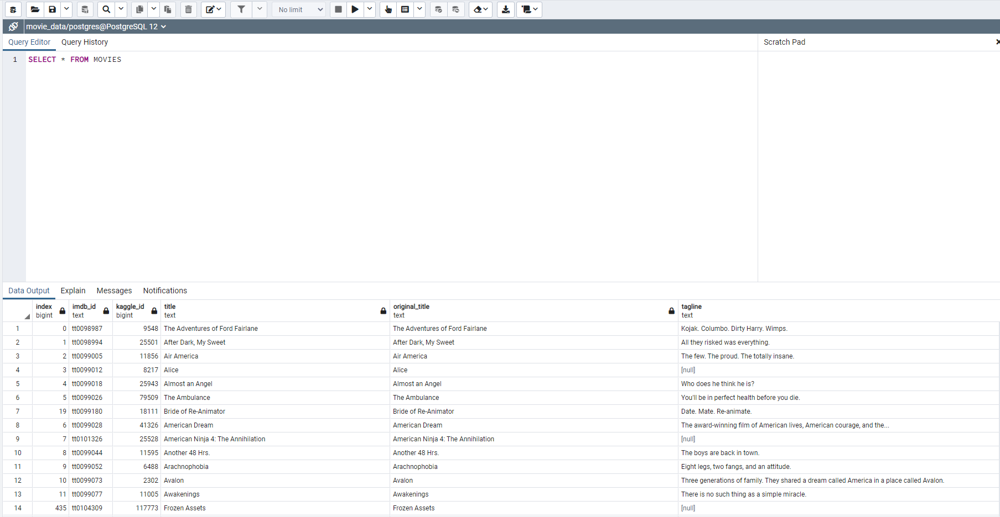

# Movies-ETL

## Overview of analysis
The purpose of this project is to create an automated pipeline that takes in data, transforms it and then loads it into an SQL database.  

### Purpose
First three files were read in python, two csv files and a json file of wikipedia data from kaggle. First the wikipedia data was modified. In the JSON file, the names of many of the columns were redundant and many of the rows were 
representative of TV shows rather than movies. We renamed the columns and removed the TV shows from the dataset. The JSON data was also converted into a dataframe. It was clear that the box office data, budget, release data, and running
time columns came in many different formats so regex was usde to match each of the formats and modify them so that all the values displayed properly in a new column.  Next the kaggle metadata was cleaned after being converted into a 
dataframe. I dropped rows based on whether data was present in certain columns and ensured that the columns were in the correct data type. I then merged the two dataframes on imdb id. Then I wrote code to move the data into a sql 
database that i created in PostgreSQL. 

Below is the cleaned and merged PostGreSQL data:

